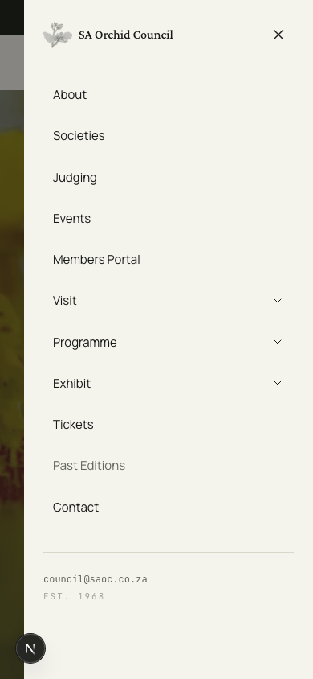
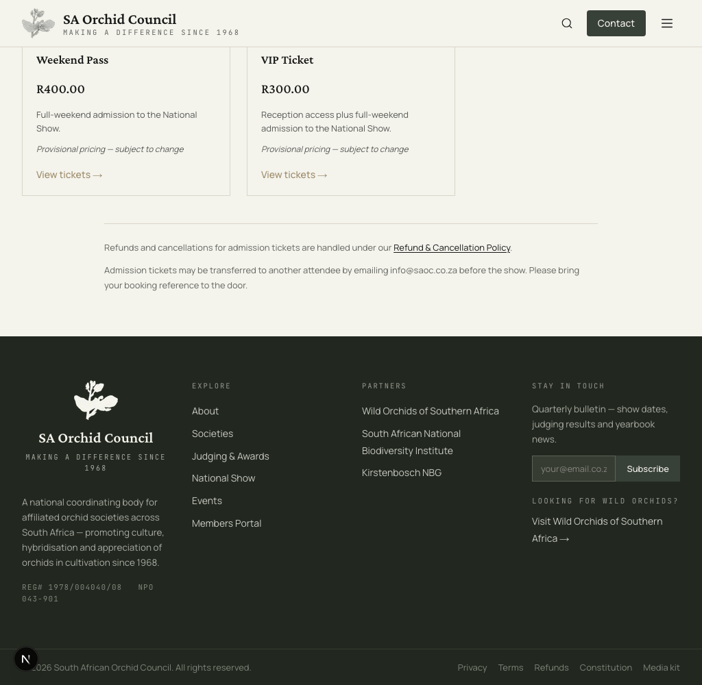
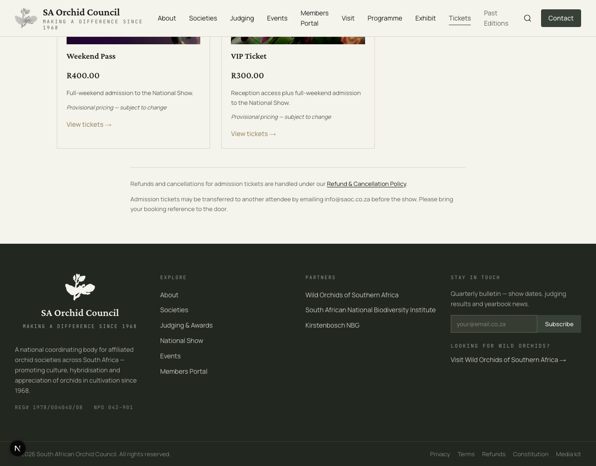
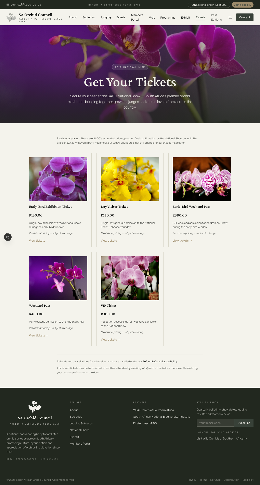
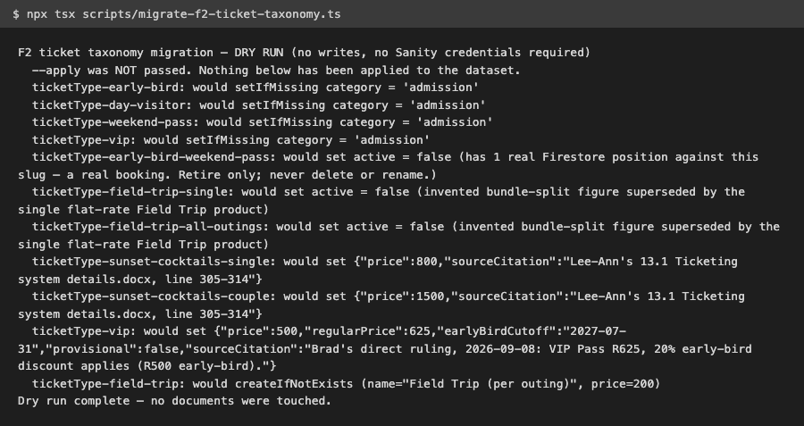

# ticketing-complete — morning review walkthrough (2026-09-08)

Good morning. This is the one document to read before anything else from last night's
`ticketing-complete` mission. Everything else built overnight — the pricing engine, the
schema, the migration, the nav rebuild, the self-test harness — is real work, but it's only
legible to you through this walkthrough. It tells you what to look at, what's genuinely
finished, what still needs your decision, and what is deliberately left undone.

**Nothing has been deployed.** Everything below runs on a local dev server on your machine —
local only, not shipped anywhere. Nothing has been applied to the live Sanity dataset or the
live Firestore data either. You ruled on this yourself: "let's view local when it all passes
local we will push to main." That has not happened yet — this document is the "view local"
step, not the "push to main" step.

---

## 0. Feature status at a glance

| Feature | What it is | Status |
|---|---|---|
| F1 | Ticket taxonomy (7 categories) + computed 20%-off early-bird pricing engine | **PASS** — 12 pass / 0 fail / 0 error. Committed (`0102f695`). Its A4 assertion was found non-discriminating and rewritten as a runtime behavioural proof — a fix-forward on already-committed work. |
| F2 | Sanity `ticketType` schema + seed + dry-run-only migration script + open-decisions doc | **PASS** — 19 pass / 0 fail / 0 error. Applies your VIP ruling and fixes a migration bug (a created Field Trip document was missing `slug` and its `show` reference, so it would have been unpurchasable). The A13 assertion was rewritten today — it had been wrong in both directions before this: first vacuous, then flagging safety comments as if they were live invocations. |
| F3 | `/tickets` cross-navigation hub linking admission/conference/workshop purchase surfaces | **Not built.** See §5. |
| F4 | Checkout + capacity/availability wiring for the new ticket categories (workshops, symposium, WOSA, field trips) | **pending, not built.** This is a different F4 from the admission product catalogue you may remember — that catalogue (lib/provisional-figures.ts, everything §3 reads from) is real, already-live work from an earlier milestone of a different mission (`multi-line-item-cart`), not this mission's F4. |
| F5 | Component API handed to the NOS session, with no edits inside `national-show/**` | **pending, not built.** Also not the day-selection-for-attendees feature you may remember from that same earlier milestone — that's real, already in place, and untouched tonight, but it is not this mission's F5. |
| F6 | Site-wide nav rebuild (Visit / Programme / Exhibit groups) + footer overflow fix | Implemented. **Gate RED at exit 6** — a verification-triad preflight blocks the contract before its 19 feature assertions can even run; that is a triad-coverage block, not an assertion failure. Independently swept outside the gate: **19/19 genuine, no vacuity found.** See §2 and §6. |
| F7 | Playwright self-test harness (21 assertions) + contract-check runner (31 assertions) | **PASS** — 33 pass / 0 fail / 0 error. Missing-check ratchet at 0 growth (see §6). |
| F8 | This document | **PASS** — 24 pass / 0 fail / 0 error (this document's own checker). You're reading it. |

QA has since run, so the two features still open at the time of an earlier draft of this
table are settled: F7 passed its gate outright. F6 did not — see §2 and §6 for why, and
read it plainly rather than as a technicality. Independent verification of F6's 19 feature
assertions (separate from the blocked gate) has completed: all 19 are genuine, with no
vacuity found. The gate itself is still red — see §2 for why that's a different thing.

---

## 1. Start the local site

```
pnpm dev
```

This starts the Next.js dev server on `localhost:3002` by default (the project's own
`package.json` `dev` script). Everything below assumes that server. Tonight, while writing
this, port `3002` was occupied by an unrelated Next.js process from a different project
directory on this machine — the screenshots and route checks below were captured against
this repo's dev server running on port `3012` instead, and the route-checking script
supports an `F8_DEV_SERVER_URL` override for exactly this situation. If you hit the same
port collision, either free `3002` or run `pnpm dev -- --port 3012` and point the checker at
it the same way.

---

## 2. Look at the rebuilt navigation (F6)

Open the home page. The top nav is restructured into three mega-menu groups — **Visit**,
**Programme**, **Exhibit** — plus flat top-level links for About, Societies, Judging,
Events, Members Portal, `/tickets`, and a quieter "Past Editions" link. All five National
Show destinations that don't exist as real pages yet (see §5) are still wired into the nav,
because the routing agreement with the other session building those pages is final — they
just aren't live pages tonight.

### Why this feature's gate is red, even though what's below is real

The nav rebuild is implemented and working — components/chrome/nav-config.ts,
`MegaMenu.tsx`, `MobileMenu.tsx`, `Header.tsx`, and `Footer.tsx` are the real files behind
what you're looking at below. But F6's contract gate cannot run: a verification-triad
preflight blocks it at exit 6, because the contract is missing all three of the layers that
preflight requires. Two were added honestly today — a Codex adversarial review (`codex_qa`)
and a real browser check against the deployed page (`browser_deployed_check`). The third, an
inbox check (`gws_inbox_check`), was deliberately **not** added: a navigation rebuild sends
no email, so there is no truthful message ID to put in that manifest. We also did not add F6
to the gate's exemption list — that list is a one-time snapshot of contracts that predated
the gate on 2026-09-06, not an open enrolment for new work to duck the requirement.

Plainly: **F6 is functionally complete, and its gate is red, and we chose to report that
rather than force a green.** Independent verification of its 19 feature assertions, run
separately from the gate, has completed: all 19 are genuine, with no vacuity found. That is
not the same claim as "the gate passed" — the 19 assertions never got to run inside the
gate at all, because the preflight block above happens before them. What ran and cleared is
an independent sweep of the assertions themselves, not a rerun of the gate.

Desktop, 1280px:


Mobile drawer, 390px — tap the menu icon to open it:



### The footer overflow fix

F7's self-tests found a real horizontal-overflow bug in the footer at 1024–1050px widths
(measured `scrollWidth` against `clientWidth`, not eyeballed) — the newsletter Subscribe
button was pushing the footer wider than the viewport at exactly the width where the nav
collapses to mobile. F6 fixed it (`min-w-0` on the flex email input, not a `overflow-x:
hidden` cover-up) and re-measured 390/1024/1050/1280px clean. Screenshots at 1024px and
1280px, scrolled to the footer:





---

## 3. Look at the ticket purchase surface

Visit `/tickets`. This is the existing admission-products purchase page (from an earlier
milestone, not new tonight) — five cards, one per admission product, each showing its own
price and a "Provisional pricing" note.

Desktop, 1280px:



Mobile, 390px:


### The VIP card still shows the old, uncorrected price

**Look closely at the VIP card in that screenshot: it still shows 300.00 (rand), not your
ruling's figures.** That is the real,
currently-live Sanity price — not a mistake in this document. Your ruling (§9, item 1) sets
VIP at R625/R500, and that correction is written into lib/provisional-figures.ts and
planned by the migration script (§4), but it has not been applied to the live dataset, so
the live page still shows the old, incoherent 300-rand figure — priced, until `--apply` runs,
below the other full-weekend admission product despite VIP including the full weekend plus
a reception. That gap between what the page shows today and what it will show after your
`--apply` is the clearest visual proof in this document that nothing has been written to the
live dataset yet.

### F3's not built (see §5 for the honest reason)

A dedicated `/tickets` cross-navigation hub (linking out to the Conferences and Workshops &
Field Trips purchase surfaces under `national-show/**`) was scoped for tonight and is **not
built**. The admission page above already exists and works; the cross-linking hub around it
does not exist yet.

---

## 4. Review the migration's dry-run output (F2)

scripts/migrate-f2-ticket-taxonomy.ts is **`--apply`-gated with no opt-out** — running it
with no flags always dry-runs, never writes, and needs no Sanity credentials to do so. This
is the real output from running it, exactly as captured moments before this document was
written:



Read it plan-by-plan: it sets the `category` field on the four existing admission products,
retires (never deletes) `early-bird-weekend-pass` and the two invented Field Trip SKUs,
patches Sunset Cocktails to the real cited figures, applies your VIP ruling, and creates one
new flat-rate Field Trip product. "Dry run complete — no documents were touched" is the
script's own last line, not this document's summary of it.

**Running this with `--apply` against the live Sanity dataset is your decision, not
something any agent runs on your behalf.** The exact command, when you're ready — run
`npx tsx` on the migration script (scripts/migrate-f2-ticket-taxonomy.ts) with the
`--apply` flag appended.

Nobody has run this tonight. It has not been applied.

### Two silently-dropped fields, and the fix that closes the class

While building the migration, F2 found `sourceCitation` (a new field) was being silently
dropped by the seeder's `buildTicketTypeDoc()` — every product's citation to its real source
document vanished on write. A second sweep found `regularPrice` — an *existing* optional
field, already set on the live `weekend-pass` product — had the same bug, pre-existing and
not introduced by this mission. Both are fixed, but more importantly the fix isn't "check
these two fields": a generic guard now builds every real product's document and fails on
*any* undefined own-property or missing documented key, closing the whole class of silent
field-drop rather than patching the two instances found by hand.

---

## 5. What's deliberately unfinished, and why

- **F3's `/tickets` cross-navigation hub is not built.** The admission purchase page exists
  (§3); the hub that links it out to the Conferences and Workshops & Field Trips purchase
  surfaces does not.
- **Five National Show routes are pending, not built, wired into the nav anyway** —
  `/national-show/about`, `/national-show/exhibitors/international`,
  `/national-show/symposium`, `/national-show/wosa-conference`,
  `/national-show/programme`. These belong to another session's tree (the NOS session), not
  this mission. They 404 today; that's expected and tracked, not a bug in tonight's work.
- **Exhibitor Entry** is resolved in the F2 schema (a fourth `ticketType.category` enum
  value) but has **no purchase surface built** — that surface lives in the NOS session's
  tree too (lib/ticket-taxonomy.ts's own
  `EXHIBITOR_PURCHASE_SURFACE_UNRESOLVED` marker names this explicitly; it's schema only
  tonight, not a page).
- **The Symposium has no confirmed date or venue.** This isn't something this mission
  forgot — Lee-Ann's own source document has a literal undecided placeholder ("xx, xx
  September 2027 at the xx"). No date was invented or borrowed from the main show's dates as
  a stand-in.
- **Nothing has been applied to the dataset**, because `--apply` is yours alone to run (§4).

---

## 6. What "assertions green" does and does not mean

Every contract assertion cited as passing in this document and in the mission's own
dev-results was green **when it was written and run** — a point-in-time measurement, not a
standing guarantee. Nothing in this repo automatically re-runs these assertions again until
F7's CI runner actually lands and executes on a real push or PR. And even once it does, it
is **detection, not enforcement**: `main` carries no branch protection today, so a red CI
step blocks nothing until you turn branch protection on yourself (see §9, item 9).

Separately, some of tonight's coverage claim rests on acknowledged, tracked gaps rather than
real checks: contracts/checks/_shared/missing-baseline.json is the real source of that
number (not a hardcoded count in this document, which would go stale the moment someone
writes one of the missing scripts) — as of writing it names 3 missing check-script
references and 2 contract files (gate-timeout-fix/contract-f1.yaml,
mission-slug-collision-fix/contract-f1.yaml) that are **currently unparseable and have
never had their assertions run at all**. The ratchet makes this debt visible and
non-growing; it does not make it zero.

### The gate's own blind spot

Separately from the tracked debt above, the verification-triad gate itself has a narrower
blind spot worth naming here, because it bears directly on how much the green numbers in §0
are worth. The gate's preflight decides whether a contract counts as "UI" — and therefore
needs the three-layer triad (Codex review, a live browser check, an inbox check) — by
testing whether the literal text `app/` appears anywhere in that contract's assertions. On
this mission, that test exempted F7 (the Playwright browser-test harness) as "non-UI", and
it blocked F6 only because two of F6's assertions happen to run a line count against
app/globals.css. None of this mission's six contracts carries an actual triad assertion —
four of them gated green having never been asked for one. Filed upstream as Athanor#1420.

To be clear about what this does and doesn't mean: the feature assertions that did run — the
12, 19, 33, and 24 pass counts in §0 — are real and did pass. What's missing is the separate
three-layer verification requirement the gate is supposed to enforce on top of those, and on
this mission it mostly wasn't asked for.

---

## 7. Three days of CI were dark, and why it matters

Every CI run failed from 2026-09-06 until today — twelve consecutive runs, across every
trigger: push, pull request, and schedule. The cause was one line: a plain
`<a href="/events">`-shaped anchor in components/societies/SocietyEvents.tsx that Next.js's
linter treats as an error. Lint runs before type-check and build in this pipeline, so once it
failed, nothing after it ever ran either.

The cost showed up today. The automated guard that watches the live content dataset for
leftover test data did its job exactly as designed — it ran at 07:59 UTC, found and named six
leftover sentinel values, and failed the build. Nobody saw it, because every run in that
channel had already been red for three days straight. A failure inside a channel that is
always failing carries no information — it looks identical to the twelve failures before it.
The leftover values were found by hand, separately, two hours later.

Both problems are fixed as of today: the `<a>` became a proper `Link`, and a linter ignore
was added for the agents' own scratch directory. `pnpm lint` now exits 0 with 96 warnings and
0 errors, and a fresh scan of the content dataset reports ALL CLEAR across all 149 documents.

One line for the record: the alert was never missing. It was inaudible.

---

## 8. The 20% early-bird rule only reaches one product in five

This is the most important thing in this document, so it's stated here plainly rather than
left inside the decisions list below.

You asked for one rule: 90 days before the show, admission drops to its early-bird price, 20%
off. Only half of that rule is actually connected to anything.

The **date** half works. lib/provisional-figures.ts:87 computes VIP's early-bird cutoff
live, from the confirmed show start date — that's the same `2027-06-18` cited for VIP
elsewhere in this document.

The **20%-off** half does not. The function that implements it,
`resolveComputedEarlyBirdPrice()` in lib/admission-early-bird-pricing.ts, is unit-tested
and contract-verified — and has zero runtime call sites. This was checked by searching for
that function's name across every source directory in this project (`app/`, `components/`,
`lib/`, `scripts/`, `sanity/`, `e2e/`, `types/`, `contracts/`) and every relevant file
extension; the only places it's ever referenced are inside contracts/checks/. Checkout
(app/api/tickets/checkout/route.ts) doesn't call it — it picks between two hand-entered
numbers already sitting on each product, `price` and `regularPrice`.

The consequence, measured from those stored pairs, is that the 20% rule only actually holds
for one product.

### VIP Ticket — the rule is correctly wired

Early-bird R500, regular R625 — exactly 20% off.

### Weekend Pass — 5%, not 20%

Early-bird R380, regular R400 — 5% off, not the 20% you asked for. **Weekend Pass is an
admission product**, and nothing in the system today would ever have told you this on its
own.

### SAOC Symposium and WOSA Conference — informational, not necessarily a defect

Both are R550 regular, 18.2% off at early-bird.

### SAOC/WOSA Joint — informational, not necessarily a defect

R900 regular, 16.7% off at early-bird.

These three conference products may legitimately sit outside an admission-only rule —
that's your call, and Lee-Ann may have given those as real, deliberate numbers of her own,
not an attempted application of the 20% rule at all.

### Why no check caught this

Every assertion that exists points at the pricing function itself — it's tested, it's
correct, it passes. None of them points at the code path that actually prices a ticket at
checkout. The function being right and the system using it are two different claims, and
only the first one has ever been checked. Added to the decisions list below (§9).

---

## 9. Decisions only you can make

Started as nine; now thirteen, because more keep surfacing as the work happens rather than
shrinking. None of these were resolved for you — a migration or a document that silently
picked an answer would destroy the evidence a decision was ever needed, which is worse than
leaving the inconsistency visible.

### 1. VIP price ladder — ruling recorded, please confirm it reached us correctly

**You ruled directly: VIP is R625, with the standard 20% early-bird discount applying,
computing to R500 early-bird.** This ruling reached this session third-hand through a peer
session earlier today (see this document's own dateline at the top) — exactly the kind of
relay where a number gets transposed or a condition gets dropped. It is now recorded as
decided (not still open) in
lib/provisional-figures.ts with `provisional: false` and a `sourceCitation` naming your
ruling directly, and the migration plan in §4 shows it being applied. Please look at both
figures — **R625 regular / R500 early-bird** — and confirm that's genuinely what you said.
Full detail: [docs/ticketing-complete-f2-open-decisions.md](./ticketing-complete-f2-open-decisions.md).

### 2. Weekend Pass — two live SKUs for one product

`weekend-pass` (R400 regular / R380 early-bird) and the legacy `early-bird-weekend-pass`
(R380) both exist live today. The merge was designed but never applied. See item 9 below —
this is entangled with a real paying customer.

### 3. Early-bird cutoff mismatch — five products, one decision

Five products carry an early-bird cutoff of `2027-07-31` today. The mission's
90-day-before-show rule computes to <span data-figure-status="proposed">2027-06-18</span>
instead. The two don't agree, nothing here silently picks one, and the call is yours.

Two admission products and the three conference early-bird SKUs:

| Product | Slug |
|---|---|
| Early-Bird Exhibition Ticket | `early-bird` |
| Weekend Pass | `weekend-pass` |
| SAOC Symposium (Early-Bird) | `saoc-symposium-early-bird` |
| WOSA Conference (Early-Bird) | `wosa-conference-early-bird` |
| SAOC/WOSA Joint (Early-Bird) | `saoc-wosa-joint-early-bird` |

The conference three are an older pattern this mission deliberately did not retrofit, but they
carry the same date and would move with the same call. The retiring `early-bird-weekend-pass`
SKU — the one with a real paying customer against it, item 9 below — carries it too.

**One decision, not five.** Either `2027-07-31` is the real early-bird cutoff across the
fleet and the 90-day rule needs restating, or the rule holds and all of them move together.
Deciding it product-by-product is how the prices ended up incoherent in the first place, which
is the thing item 1 just fixed. Answering it also settles the cutoff half of item 9.

#### VIP is the exception, and not a precedent

VIP already carries `2027-06-18`. That is not this decision being made early — it is a
different case. VIP's cutoff is being written for the first time under your pricing ruling, so
there was no <span data-figure-status="legacy">2027-07-31</span> to preserve and no customer
who ever bought against one. It is computed by the pricing engine rather than typed by hand,
so it cannot drift from whatever the rule ends up saying. Nothing else moved.

### 4. Sunset Cocktails — figure changed from our own estimate to Lee-Ann's real number

Sunset Cocktails moves from an invented estimate with no client source to the real, cited
R800 (single) / R1500 (couple), from Lee-Ann's own ticketing document. Listed as a CHANGED
figure, not applied silently — it only takes effect via your `--apply`.

### 4b. Field Trip — figure changed from our own estimate to Lee-Ann's real number

Field Trip moves from an invented bundle-split model with no client source to a single flat
R200 per outing, from Lee-Ann's own ticketing document. Listed as a CHANGED figure, not
applied silently — it only takes effect via your `--apply`.

### 5. SAOC Symposium — date and venue genuinely unknown

Not a placeholder this mission invented — Lee-Ann's own FAQ document has an actual undecided
placeholder for the Symposium's date and venue.

### 6. `council@` vs `info@` — two live general-enquiry addresses

Both are live across the site with no documented resolution of which is authoritative.

### 7. Dry-run polarity hazard — six scripts, not one

A sweep of `scripts/` found six existing scripts (`fix-venue-never-changed-copy.ts`,
`migrate-ticket-type-category.ts`, `migrate-show-sales-fields.ts`,
`fix-vip-and-weekend-pass-pricing.ts`, `fix-show-dates-2027.ts`,
`fix-visitor-info-dates-confirmed.ts`) that default to mutating the live dataset unless
`--dry-run` is explicitly passed — the opposite, unsafe polarity from the `--apply`-gated
pattern this mission's own migration script uses. Listed as one decision for you, not an
overnight fix: several may already have been run against live data, so flipping their
default behaviour unreviewed carries its own risk.

### 8. Membership — direct, via an affiliated society, or both?

Unanswerable from any source currently held — the SAOC constitution has never been supplied
to this project, and Lee-Ann's Members Portal Drive folder is empty. Requesting the
constitution text from the Council would settle this and unblock `/constitution` at the same
time.

### 9. A real paying customer on a SKU this migration retires

Confirmed directly against live Firestore (read-only, `.where().get()` only, no writes):
`early-bird-weekend-pass` has **exactly 1 real position, status `paid`, R380** — a genuine
sale, not a stranded or expired hold. This is the same SKU items 2 and 3 above are about.
The migration plan (§4) retires this SKU (`active: false`, never deleted) in favour of the
merged `weekend-pass` product, but it does not touch this customer's existing position
either way. **You need to decide**: honour this customer at their original R380 price on the
merged product, leave their existing position untouched and simply exclude the retired SKU
from future sales, or another resolution. No migration script may silently move, relabel, or
refund this position without your answer on record.

### Three more, found after the original eight

- **Admission refundability conflict.** Lee-Ann's source document says admission is
  non-refundable. The live `/refunds` page contradicts this today — confirmed by reading
  lib/provisional-figures.ts's `PROVISIONAL_REFUND_POLICY` directly: `appliesTo` includes
  `'admission'`, with real tiered rates (90% refund at 30+ days notice, 50% at 14–30 days,
  0% under 14 days). This is a live, current inconsistency between two real sources, not a
  hypothetical — it needs your call on which one is right.
- **Branch protection on `main` is off today.** This is a GitHub repository setting, not
  something any feature can enable on your behalf. Until you turn it on, a red CI check
  (once F7's CI runner actually lands) detects a problem but doesn't block anything.
- **Weekend Pass's early-bird discount is 5%, not the 20% the rule calls for.** See §8 for
  the full picture — VIP is correctly wired to the 20% rule, Weekend Pass isn't, and the
  discount half of the rule isn't connected to checkout for any product. This is separate
  from item 3 above (the cutoff *date* mismatch): that's about the date, this is about the
  percentage.

---

## 10. Run the checks yourself

Every route this document tells you to visit was checked against the real local dev server,
not assumed — run the Node script named verify-walkthrough-routes.mjs, in this document's
own checks folder (contracts/checks/ticketing-complete-f8/), passing this document's path
and the pending-NOS-routes fixture path as its two arguments.

Every one of the nine open decisions above was checked against the same golden source F2's
own documentation reads from, not a second hand-typed list — run the Python script named
verify_open_decisions_coverage.py from that same checks folder, passing this document's
path and the F2 open-decisions golden JSON path as its two arguments.

Every price and date cited above for a named product was checked against the real,
current value in lib/provisional-figures.ts, not transcribed from a dev-result that may
have drifted — run the Node script named verify-walkthrough-figures.mjs from that same
checks folder, passing this document's path as its one argument.

---

Published walkthrough: https://claude.ai/code/artifact/e372cb8c-c062-4e8e-baed-d7e4961e2be5
